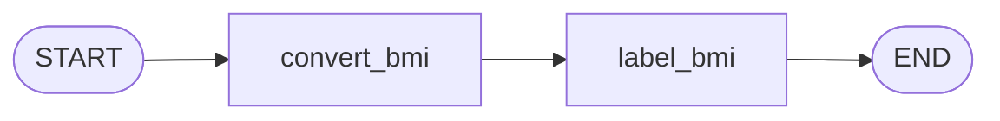
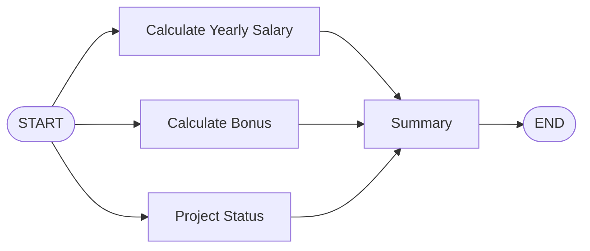
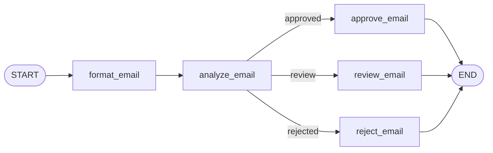
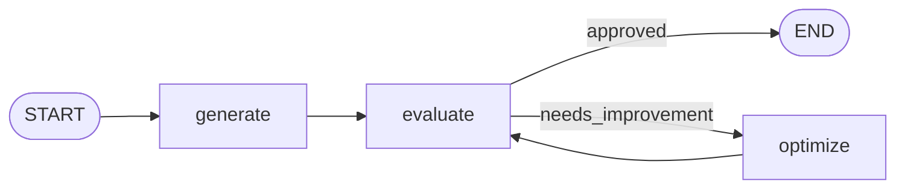

# Portfolio LangGraph Workflow

Proyek ini berisi portofolio implementasi beberapa pola **workflow LangGraph** menggunakan pendekatan graph-based orchestration untuk task AI/LLM.

## Ringkasan

Di folder [2_workflow/](/C:/Belajar/langgraph-course/2_workflow), saya telah menerapkan beberapa tipe workflow utama:
- Workflow linear (sequential)
- Prompt chaining
- Workflow paralel
- Conditional routing
- Iterative refinement loop
- Persistence/checkpoint

Implementasi menggunakan **LangGraph + LangChain** dengan model lokal via **Ollama** (`llama3.2:3b`) dan beberapa eksperimen structured output (Pydantic schema).

## Daftar Workflow yang Diimplementasikan

| No | Notebook | Pola Workflow | Deskripsi Singkat |
|---|---|---|---|
| 1 | [1.bmi-workflow.ipynb](/C:/Belajar/langgraph-course/2_workflow/1.bmi-workflow.ipynb) | Linear | Menghitung BMI lalu memberi label kategori secara berurutan. |
| 2 | [2.simple-qa.ipynb](/C:/Belajar/langgraph-course/2_workflow/2.simple-qa.ipynb) | Single-node QA | Menjawab pertanyaan user dengan satu node LLM. |
| 3 | [3.prompt-chaining.ipynb](/C:/Belajar/langgraph-course/2_workflow/3.prompt-chaining.ipynb) | Prompt Chaining | Output node pertama (susun tim) menjadi input node kedua (strategi). |
| 4 | [4.pararel.ipynb](/C:/Belajar/langgraph-course/2_workflow/4.pararel.ipynb) | Parallel Branching | Salary, bonus, dan status proyek dihitung paralel lalu digabung ke ringkasan. |
| 5 | [5.pararel-llm.ipynb](/C:/Belajar/langgraph-course/2_workflow/5.pararel-llm.ipynb) | Parallel LLM Evaluation | Esai dinilai dari beberapa aspek (language/analysis/clarity) secara paralel lalu agregasi final. |
| 6 | [6.condition.ipynb](/C:/Belajar/langgraph-course/2_workflow/6.condition.ipynb) | Conditional Flow | Email diklasifikasi (approved/review/rejected) lalu diarahkan ke node tindak lanjut sesuai kondisi. |
| 7 | [7.conditional-llm.ipynb](/C:/Belajar/langgraph-course/2_workflow/7.conditional-llm.ipynb) | Conditional + Structured Output | Analisis sentimen review dan routing otomatis ke respons positif/penanganan negatif. |
| 8 | [8.iterative-llm.ipynb](/C:/Belajar/langgraph-course/2_workflow/8.iterative-llm.ipynb) | Iterative Loop | Generate post → evaluate → optimize berulang sampai approved / max iteration. |
| 9 | [9.persistance.ipynb](/C:/Belajar/langgraph-course/2_workflow/9.persistance.ipynb) | Persistence & Recovery | Menyimpan state via checkpointer (`InMemorySaver`) untuk resume thread/checkpoint. |

## Kompetensi yang Ditunjukkan

- Merancang state graph dengan `StateGraph`, `START`, `END`
- Menyusun node function modular untuk business logic dan LLM calls
- Menerapkan `add_conditional_edges` untuk routing dinamis
- Menjalankan workflow paralel untuk mempercepat evaluasi multi-aspek
- Membangun iterative self-improving loop berbasis feedback
- Menggunakan structured output (Pydantic) untuk hasil lebih terkontrol
- Mengaktifkan persistence untuk reliability dan resume eksekusi

## Teknologi yang Digunakan

- Python 3.12+
- LangGraph
- LangChain
- LangChain Ollama
- LangChain Google GenAI (eksperimen model eksternal)
- Pydantic
- Jupyter Notebook

Dependency utama dapat dilihat di:
- [pyproject.toml](/C:/Belajar/langgraph-course/pyproject.toml)
- [requirements.txt](/C:/Belajar/langgraph-course/requirements.txt)

## Cara Menjalankan

1. Install dependency:
   - `uv sync` atau `pip install -r requirements.txt`
2. Jalankan Ollama dan pastikan model tersedia:
   - `ollama pull llama3.2:3b`
3. Buka notebook di folder [2_workflow/](/C:/Belajar/langgraph-course/2_workflow) menggunakan Jupyter/VS Code.
4. Eksekusi cell per notebook untuk melihat alur graph, visualisasi, dan hasil inferensi.

## Catatan Portofolio

Fokus utama portofolio ini adalah menunjukkan pemahaman pola orkestrasi agentic workflow pada LangGraph, dari alur sederhana hingga workflow dinamis dan persisten.

## Gambar Workflow

### 1) Linear Workflow (BMI)

### 2) Parallel Workflow (Employee Summary)

### 3) Conditional Workflow (Email Routing)

### 4) Iterative Workflow (Generate-Evaluate-Optimize)

## Sumber Belajar

Saya mempelajari materi utama implementasi ini dari YouTube:
- [LangGraph Course - YouTube](https://www.youtube.com/watch?v=Zy7EXDONlTY&t=11001s)